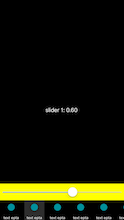

# WIZBottomMenu

- create buttons on bottom menu
- add top menu depending on which button you click

 

HOW TO INSTALL

Import files from the folder "WIZBottomMenu Obj-C" to your project. 

HOW TO USE

**initialized**

*-(id)initWithTopViewHeight:(float)topHeight bottomViewHeight:(float)btmHeight;*

Be sure to specify the height of the upper and lower menu items

*-(void)setTextColor:(UIColor\*)color;*

Specify the text color under the buttons

*-(void)setSelectColor:(UIColor\*)color*

Specify the color of the selection of buttons

**Use delegate**

*-(NSInteger)countSectionsWIZBottomMenu:(WIZBottomMenu\*)bottomMenu;*

Count sections (buttons) in the menu

*-(WIZBottomMenuBtn\*)WIZBottomMenu:(WIZBottomMenu\*)bottomMenu buttonAtIndex:(NSInteger)index;*

Images and titles in buttons

*-(UIView\*)WIZBottomMenu:(WIZBottomMenu\*)bottomMenu selectedViewAtIndex:(NSInteger)index*

View showed after tap the button
